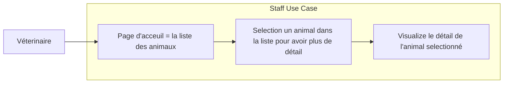
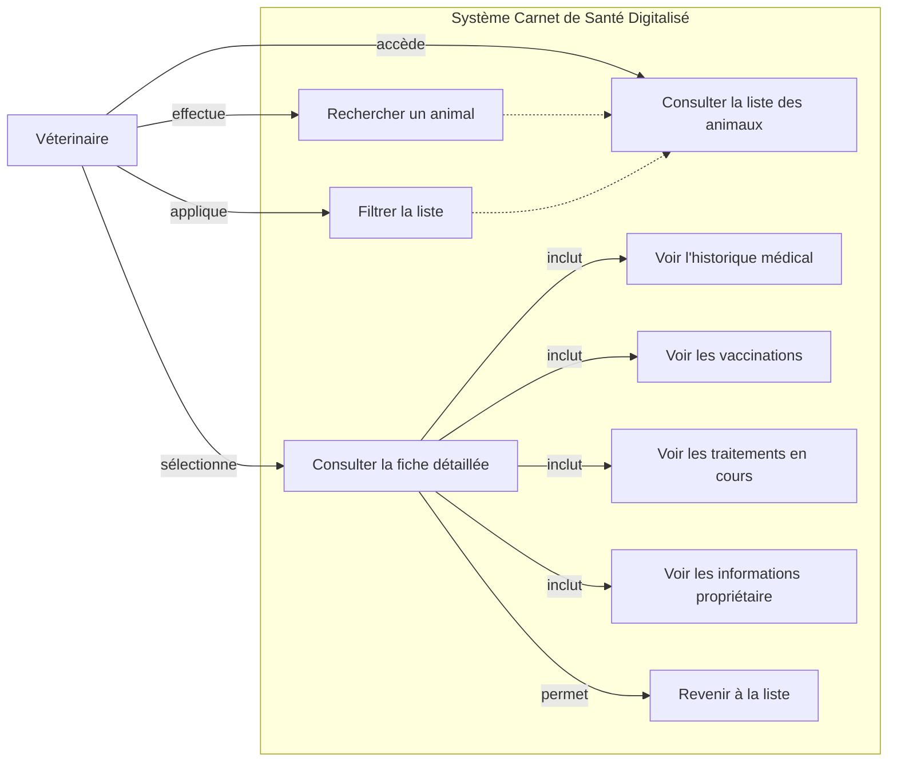

# Diagrammes, User story et persona - Patte & Cie

## Persona : Dr. Sophie Moreau

- Âge : 38 ans
- Profession : Vétérinaire
- Expérience : 12 ans en clinique vétérinaire
- Localisation : Clinique vétérinaire en zone périurbaine
- Niveau technologique : Intermédiaire (utilise smartphone et ordinateur quotidiennement, mais préfère les interfaces simples)

### Contexte professionnel

Consulte 15-20 animaux par jour
Fait partie d'une équipe de 3 vétérinaires
Travaille avec 2 assistantes vétérinaires et 1 secrétaire
Jongle entre consultations, urgences et chirurgies
Peu de temps entre chaque patient (10-15 minutes)

### Objectifs

Accéder rapidement aux informations médicales pendant une consultation
Vérifier l'historique des traitements et vaccinations sans quitter la salle de consultation
Consulter les notes des collègues sur les animaux qu'elle voit pour la première fois
Gagner du temps pour se concentrer sur le soin des animaux plutôt que sur la recherche administrative

### Frustrations actuelles

Perd du temps à chercher les dossiers papier dans l'archive
Dossiers parfois utilisés par un collègue au même moment
Difficulté à lire certaines notes manuscrites de ses collègues
Informations dispersées dans plusieurs documents
Stress quand elle ne retrouve pas rapidement une information critique (allergies, traitements en cours, dernière intervention)

### Besoins spécifiques

Interface rapide à charger (connexion parfois instable dans certaines salles de consultation)
Informations essentielles visibles immédiatement (nom, race, âge, allergies, propriétaire)
Recherche efficace par nom d'animal ou nom de propriétaire
Historique complet chronologique et facile à parcourir
Lisibilité sur tablette ou ordinateur de consultation
Accès sécurisé réservé au personnel de la clinique

---

## Use Case : Navigation et Consultation (Utilisateur)

---

## User Story

User Story

En tant que vétérinaire,

Je veux avoir accès à la liste des animaux, filtrer et rechercher dans cette liste et avoir accès à la fiche détaillée de chacun des animaux sur cette liste,

Afin d'avoir accès à une liste détaillée de tous les animaux qui sont traités dans mon cabinet avec fluidité et organisation sans contraintes.

---

## Parcour d'utilisateur : Navigation et Consultation (Utilisateur)
